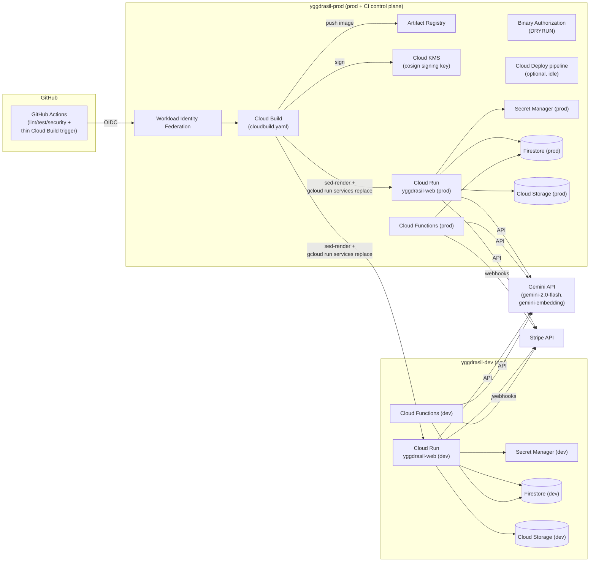
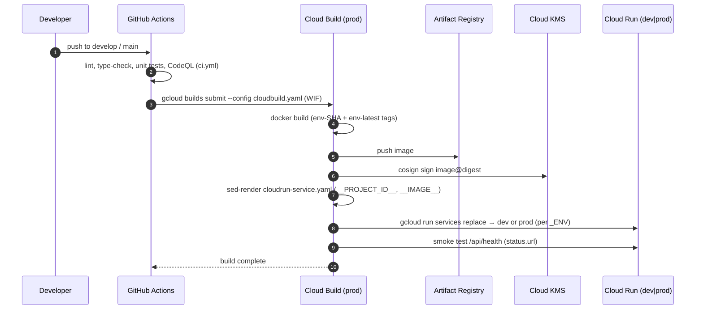

# Yggdrasil — Architecture & CI/CD

> Source of truth for the GCP runtime architecture, the continuous-delivery flow, and the
> operational bring-up procedure. Complements [DEPLOYMENT.md](DEPLOYMENT.md) (which keeps the
> higher-level runbook) and [README.md](../README.md) (product context).

---

## 1. Design decisions

| Decision | Choice | Rationale |
|---|---|---|
| Projects | **2 GCP projects**: `yggdrasil-dev`, `yggdrasil-prod` | True dev/prod isolation, one Firebase project per env. No separate "shared" project — CI control-plane services live in **prod**. |
| Build source of truth | **Cloud Build** (`cloudbuild.yaml`) | GitHub Actions is a thin trigger (`gcloud builds submit`); build/sign/deploy logic lives in GCP. |
| Delivery | **Direct Cloud Run deploy** via `gcloud run services replace` | Dev and prod both deploy directly (100% traffic). Cloud Deploy canary infra is provisioned but idle — wire it for prod canary when ready (see §10). |
| Supply-chain security | Cosign (Cloud KMS) + Binary Authorization | Policy starts in **DRYRUN** so a broken attestation never blocks deploys; flip to `ENFORCED` once validated. |
| Secrets | **Secret Manager per project**, injected as **env vars** | The app reads `process.env.*`; secrets are mounted as environment variables (not files). Each env owns its own secrets. |
| Auth to GCP from GitHub | **Workload Identity Federation (OIDC)** | No long-lived service-account keys in GitHub. |
| Domains | `*.run.app` default URLs | No custom domain purchased. Swap in `dev.yggdrasil.app` / `yggdrasil.app` later by verifying ownership. |

---

## 2. High-level architecture



---

## 3. Project layout & ownership

| Layer | `yggdrasil-dev` | `yggdrasil-prod` |
|---|---|---|
| **Web app** | Cloud Run `yggdrasil-web-dev` | Cloud Run `yggdrasil-web` |
| **Backend** | Cloud Functions (Firebase, 2nd gen) | Cloud Functions (Firebase, 2nd gen) |
| **Database** | Firestore `(default)`, nam5, PITR | Firestore `(default)`, nam5, PITR |
| **Storage** | `-assets`, `-backups` | `-assets`, `-backups` |
| **Secrets** | Secret Manager (dev values) | Secret Manager (prod values) |
| **CI control plane** | — | Artifact Registry, Cloud Build, Cloud Deploy, KMS, Binary Authz, WIF, Terraform state bucket |
| **Observability** | Monitoring SLOs (99% / 3s) | Monitoring SLOs (99.9% / 2s) |

The dev Cloud Run and Cloud Functions services pull their container image from the **prod** Artifact
Registry (cross-project). The Terraform `shared` layer grants the dev runtime SA
`roles/artifactregistry.reader` on prod so the pull succeeds.

---

## 4. CI/CD flow (end to end)



> **Functions** deploy on a separate path (`deploy-functions.yml` → `cloudbuild-functions.yaml`):
> `firebase deploy --only functions` + Firestore/Storage rules.

### 4.1 Pipeline files

| File | Role |
|---|---|
| `.github/workflows/ci.yml` | Quality gates only — lint, type-check, tests, CodeQL, dependency review. Runs on PRs and pushes. **No build/deploy.** |
| `.github/workflows/deploy.yml` | Thin Cloud Build trigger. On push to `develop`/`main` (and `workflow_dispatch`) authenticates via WIF and runs `gcloud builds submit --config cloudbuild.yaml`. |
| `.github/workflows/deploy-functions.yml` | Thin Cloud Build trigger for Firebase Cloud Functions + rules. |
| `.github/workflows/terraform.yml` | `plan` on PRs (comments back), `apply` on merge to `main` (shared → dev → prod). |
| `cloudbuild.yaml` | **Source of truth for build/sign/deploy** of the web app. Builds per `_ENV`, signs (cosign+KMS), renders `cloudrun-service.yaml`, deploys via `gcloud run services replace`. |
| `cloudbuild-functions.yaml` | Builds + deploys Firebase Cloud Functions + Firestore/Storage rules. |
| `cloudrun-service.yaml` | Cloud Run service manifest (sed-rendered with `__PROJECT_ID__` / `__IMAGE__`). |
| `terraform/**` | All infrastructure as code (3 state layers, 2 projects). |

### 4.2 Branch → environment mapping

| Branch | Trigger | Result |
|---|---|---|
| PR → `main`/`develop` | `ci.yml` + `terraform.yml plan` | Quality gates + infra plan comment |
| push `develop` | `deploy.yml` (`_ENV=dev`) + `deploy-functions.yml` | Web + functions deployed to **dev** |
| push `main` | `deploy.yml` (`_ENV=prod`) + `deploy-functions.yml` | Web + functions deployed to **prod** |
| manual (workflow_dispatch) | `deploy.yml` / `deploy-functions.yml` | Deploy chosen env |

---

## 5. Secrets

Secrets live in **each project's** Secret Manager and are injected into Cloud Run as **environment
variables** (the app reads `process.env.*`, never mounted files).

| Env var (consumed by app) | Secret Manager ID | Set on |
|---|---|---|
| `GEMINI_API_KEY` | `gemini-api-key` | Cloud Run + Cloud Functions |
| `FIREBASE_ADMIN_PRIVATE_KEY` | `firebase-admin-private-key` | Cloud Run |
| `FIREBASE_ADMIN_CLIENT_EMAIL` | `firebase-admin-client-email` | Cloud Run |
| `GA4_API_SECRET` | `ga4-api-secret` | Cloud Run |
| `STRIPE_SECRET_KEY` | `stripe-secret-key` | Cloud Run + Cloud Functions |
| `STRIPE_WEBHOOK_SECRET` | `stripe-webhook-secret` | Cloud Functions |
| `STRIPE_PUBLISHABLE_KEY` | `stripe-publishable-key` | Cloud Run (build-time, `NEXT_PUBLIC_*`) |

Non-secret config (`NEXT_PUBLIC_FIREBASE_*`, model names, price IDs) is passed as plain env vars at
build/run time. See `.env.production.example` and `functions/.env.production.example`.

> The Firebase Admin SDK in `lib/firebase/admin.ts` falls back to **Application Default Credentials**
> when `FIREBASE_ADMIN_PRIVATE_KEY` is absent — so on Cloud Run the runtime SA identity is used and
> only `FIREBASE_ADMIN_PROJECT_ID` + `FIREBASE_ADMIN_CLIENT_EMAIL` are strictly required.

---

## 6. GCP services

| Service | Purpose | Project |
|---|---|---|
| Cloud Run | Next.js container | dev + prod |
| Cloud Functions (2nd gen) | `analyzeEntry`, `transcribeAudio`, `yggiChat`, `computeHiddenConnections`, `onRootWrite`, `generateBranchActions`, `generateWeeklyReport`, `backfillEmbeddings`, `onUserCreate`, `createCheckout`, `createBillingPortalSession`, `stripeWebhook` | dev + prod |
| Firestore (Native) | Primary DB + vector search | dev + prod |
| Cloud Storage | Voice notes, assets, backups | dev + prod |
| Secret Manager | API keys | dev + prod |
| Artifact Registry | Docker images | prod |
| Cloud Build | Container + function builds | prod |
| Cloud Deploy | Progressive delivery | prod |
| Cloud KMS | Cosign signing key | prod |
| Binary Authorization | Supply-chain policy (DRYRUN) | prod |
| Workload Identity Federation | GitHub OIDC | prod |
| Cloud Monitoring | SLOs, uptime, alerts | dev + prod |
| Cloud Logging | Sinks → BigQuery + GCS | dev + prod |

---

## 7. Observability

| Metric | Dev | Prod |
|---|---|---|
| Availability SLO | 99.0% | 99.9% |
| Latency P99 SLO | < 3s | < 2s |
| Uptime checks | 3-region, `/api/health` | 3-region, `/api/health` |
| Alert: error rate | > 1% (5m) | > 0.1% (5m) |

Logs sink to BigQuery (`logs_analytics` dataset) and a lifecycle-managed GCS bucket. Health endpoint:
`GET /api/health` → `{ "status": "ok" }`.

---

## 8. Bring-up guide

> You will perform this once. The secrets you provide are injected into Secret Manager via Terraform
> (`secret_values` map) or `gcloud secrets create`.

### 8.1 Prerequisites

```bash
gcloud auth login
gcloud auth application-default login
```

- Billing account available.
- GitHub repo with Actions enabled.

### 8.2 Create the two projects + link billing

```bash
BILLING=YOUR_BILLING_ACCOUNT_ID
for P in yggdrasil-dev yggdrasil-prod; do
  gcloud projects create $P --name="Yggdrasil ${P##*-}"
  gcloud billing projects link $P --billing-account=$BILLING
done
```

### 8.3 Bootstrap Terraform state + apply control plane

```bash
./scripts/setup-terraform.sh        # creates state bucket, applies terraform/shared (prod control plane)
```

Outputs you need for GitHub:
- `workload_identity_provider`
- `service_account_emails.github-deployer`

### 8.4 Create the two Firebase projects

```bash
firebase projects:create yggdrasil-dev --name "Yggdrasil Dev"
firebase projects:create yggdrasil-prod --name "Yggdrasil Prod"
firebase use --add yggdrasil-dev  # alias: dev
firebase use --add yggdrasil-prod # alias: prod
```

Enable required Firebase products in each (Auth, Firestore, Storage) — Terraform creates Firestore;
Auth + Storage are enabled via the Firebase console or `firebase deploy`.

### 8.5 Apply environment Terraform

```bash
# From repo root
cd terraform/environments/dev  && terraform init && terraform apply
cd ../prod                     && terraform init && terraform apply
```

### 8.6 Load secrets into Secret Manager

Provide values for each project (`dev` and `prod`) — see the matrix in §5. Either via Terraform
`secret_values` or directly:

```bash
PROJECT=yggdrasil-prod
for NAME in gemini-api-key firebase-admin-private-key firebase-admin-client-email \
            ga4-api-secret stripe-secret-key stripe-webhook-secret stripe-publishable-key; do
  printf "%s" "$(<value>)" | gcloud secrets create $NAME --data-file=- --project=$PROJECT \
    || gcloud secrets versions add $NAME --data-file=- --project=$PROJECT
done
# repeat for PROJECT=yggdrasil-dev
```

### 8.7 Configure GitHub secrets

Repo → Settings → Secrets and variables → Actions:

| Secret | Value |
|---|---|
| `WIF_PROVIDER` | `projects/<PROD_NUMBER>/locations/global/workloadIdentityPools/github-actions-pool/providers/github-provider` |
| `GITHUB_DEPLOYER_SA` | `github-deployer@yggdrasil-prod.iam.gserviceaccount.com` |
| `TERRAFORM_SA` | `github-deployer@yggdrasil-prod.iam.gserviceaccount.com` |
| `SLACK_WEBHOOK` | (optional) |

Create GitHub **environments**: `dev` (no protection) and `production` (required reviewers + `main` branch).

### 8.8 First deploy

```bash
git push origin develop            # triggers CI + Cloud Build → dev (web + functions)
# verify dev, then promote to prod:
./scripts/deploy-prod.sh           # builds + deploys prod web
```

Or trigger manually from GitHub Actions → **Build & Deploy (Cloud Build)** → Run workflow → `prod`.

---

## 9. Rollback

Re-run a previous build by SHA:

```bash
./scripts/deploy.sh dev  <previous-sha>
./scripts/deploy.sh prod <previous-sha>
```

Cloud Run keeps prior revisions; you can also split/rollback traffic:

```bash
gcloud run services describe yggdrasil-web --region=us-central1 --format=yaml   # list revisions
gcloud run services update-traffic yggdrasil-web --to-revisions=REVISION=100 --region=us-central1
```

> When Cloud Deploy canary is enabled (§10), a bad prod release is auto-aborted during the `verify`
> phases.

---

## 10. Known limitations / next steps

- **Binary Authorization** is `DRYRUN_AUDIT_LOG_ONLY`. Move to `ENFORCED_BLOCK_AND_AUDIT_LOG` after the
  first signed release is validated.
- **Prod canary** is not active in the default flow (prod deploys at 100%). Cloud Deploy infra is
  provisioned (`terraform/modules/cloud-deploy`, idle) — wire it in `shared/main.tf` + add a skaffold
  source to enable `5/25/50/100%` progressive delivery with SLO verification.
- **Stripe secrets in Cloud Functions** still use `process.env` directly; migrate them to
  `defineSecret()` (see `functions/src/lib/gemini.ts` pattern) so 2nd-gen functions mount them.
- **Custom domains** not configured (no domain purchased). Add Cloud Run domain mappings + verified
  ownership when ready.
- **VPC Service Controls / Cloud Armor** not yet configured (listed in DEPLOYMENT.md §Next Steps).
- **Firebase data** from the legacy `yggdrasil-497923` project is not migrated; bring-up starts fresh
  in `yggdrasil-dev` / `yggdrasil-prod`.
